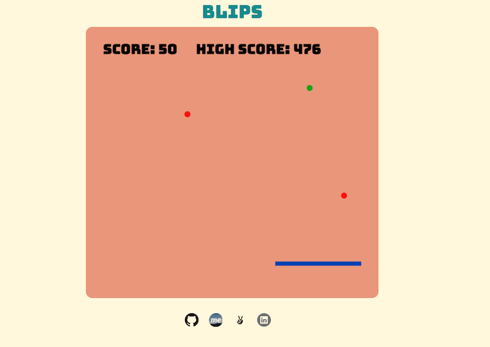

# Blips
[Blips](http://joekatz.me/Blips) is a one player game with bouncing balls that have a value that increases after 20 hits. Once the ball hits the paddle, it moves on to the next third of the screen. Multiple balls fall at the same time and the user is not allowed to miss any of the balls.

## Instructions
Click Play and you will be using the left, down, and right arrows to move the paddle. The down button (for the middle paddle) is different for most gamers expecting a smooth left and right transitions. The goal is to ensure that no ball goes past the paddle line, otherwise you lose. The number of balls will increase and the game will get harder.

## Screenshots

